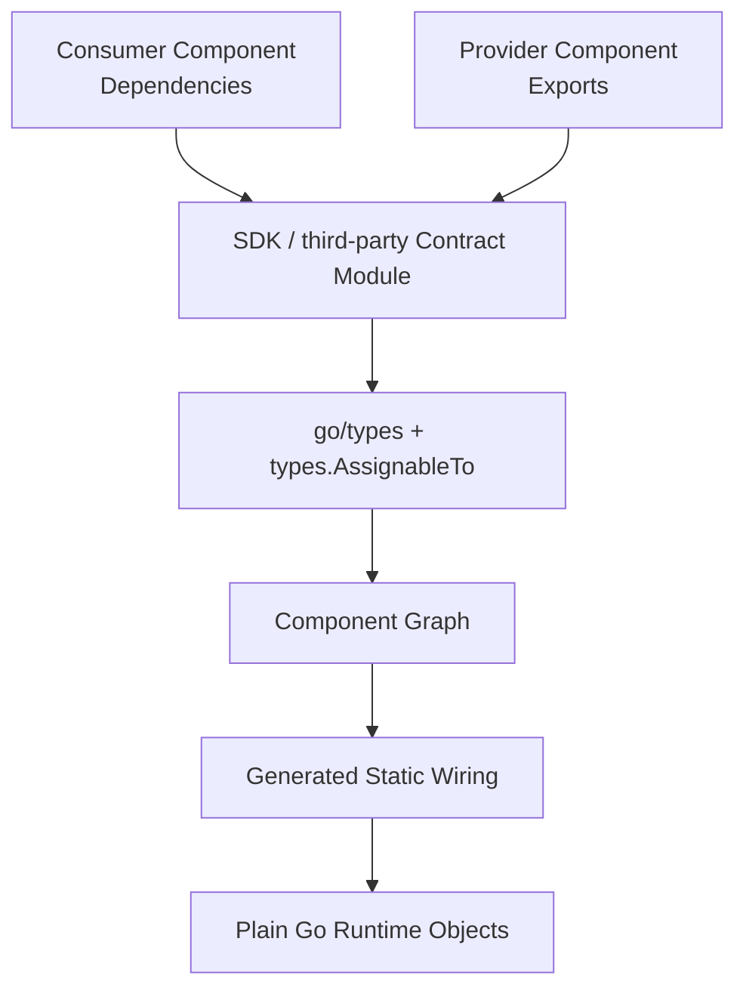
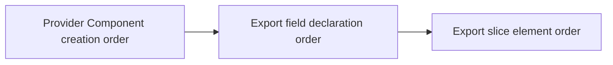
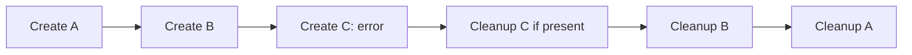
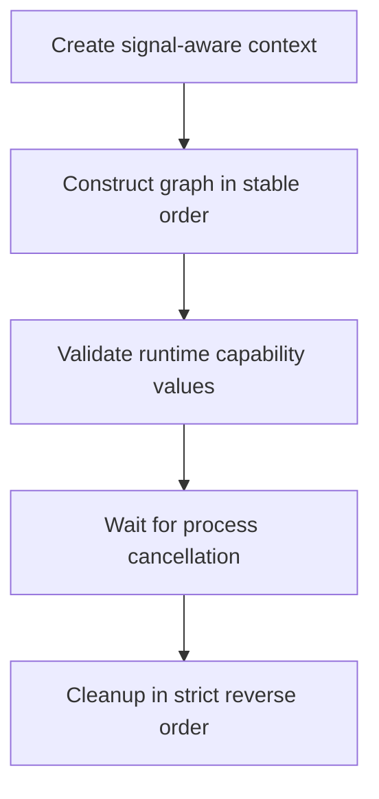
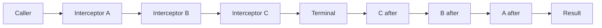
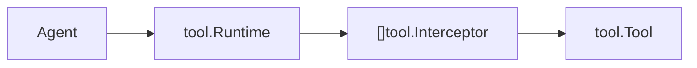
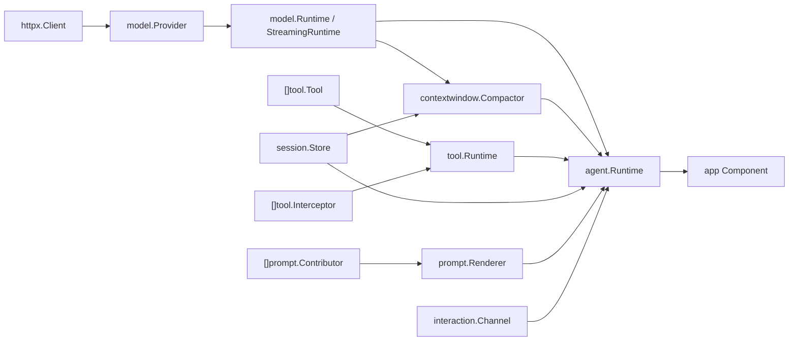
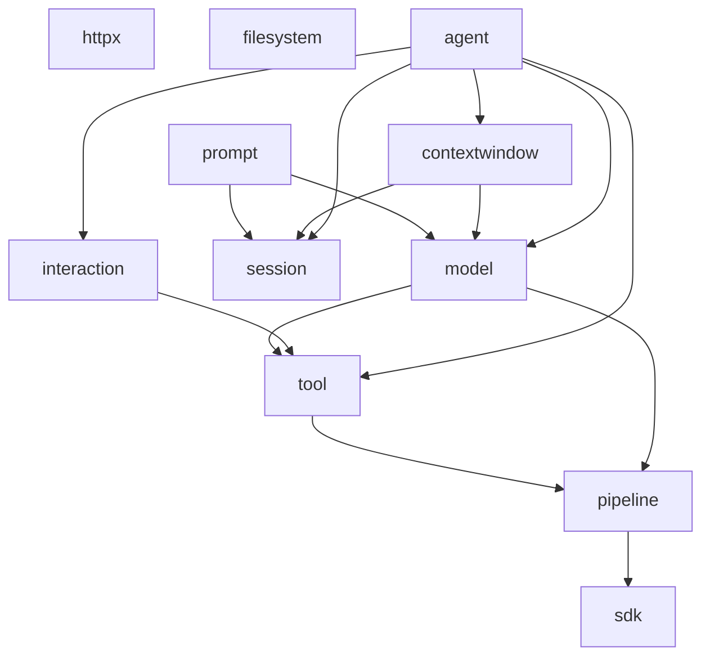
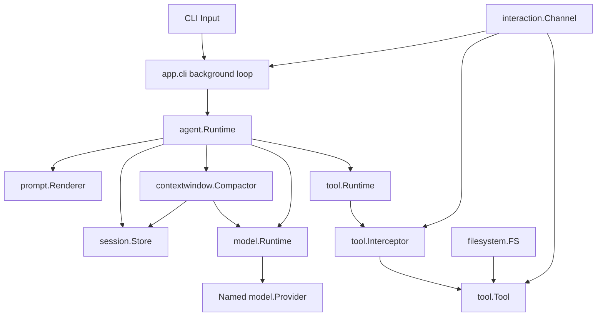

# ingot SDK v0.1 设计方案

> **历史设计 / Historical design — 非当前 API 参考。**
> 本文从 Core 迁入合同所属仓库；当前合同见[仓库 README](../../README.md)、包文档和测试。
> 旧版 `New(ctx, cfg, deps)`、统一 Runtime 配置、静态 Provider 和文本流示例不代表当前 Builder/SDK 接口。
> 原文来源：Core commit `6739c7cb5e90560b75bb39d631c926bc1587c878`，原文采用 [MIT 许可](./LICENSE.mit.txt)。

> 状态：Historical baseline，已按 SDK v0.1.6 / ingot ABI v0.1 修订边界
> 目标版本：SDK v0.1  
> 关联规范：架构 v0.3、Plugin Manifest v0.1、`plugins.lock` v0.1

> 注意：Component ABI primitive、Invocation、Lifecycle 与 State host Contract
> 已迁移到 `github.com/ingot-agent/ingot-abi`。ABI 的当前规范以
> 《ingot ABI v0.1 设计提案》和该仓库 README 为准；本文件其余章节描述可替换
> Agent Contract 的 v0.1 设计背景。

## 1. 定位

ingot SDK 是 Component Graph 的公共 Go Contract 层。Builder 读取 Component 的 `Dependencies` 与 `Exports`，基于 Go Type 建图并生成静态 wiring；Runtime 运行普通 Go 对象。

SDK 提供：

- 稳定的 Tool、Model、Session、Prompt、Context Window、Interaction、Agent 等领域 Contract；
- typed Interceptor；
- Context、生命周期、错误、并发和 ownership 语义。



SDK 的设计目标是小、稳定、显式、typed，并保持普通 Go Library 的使用方式。

## 2. 设计原则

1. Component 依赖稳定 Contract Module，通过 Go Type Identity 连接。
2. Plugin/Component identity、Manifest、版本、顺序和 ImageID 由 Manifest、lock 与 Builder 管理。
3. MANY collection 承载集合扩展；typed Interceptor 承载控制流扩展。
4. Tool、Model 与 Agent 使用明确的 Runtime chokepoint。
5. 阻塞操作接收 `context.Context`，参数 Context 是 cancellation/deadline authority。
6. `New` 创建独立实例；长期任务归实例生命周期管理。
7. Public value 具有明确 ownership 与 mutability 规则。
8. SDK v0.1 聚焦 text、tool calling、可选 context compaction、单 interaction scope 和静态 Component composition。

官方 SDK Contract 的 module path：

```text
github.com/ingot-agent/sdk
```

第三方可发布独立、实现无关的 Contract Module。Builder 对所有 Contract 使用相同的 Go Type 规则。

## 3. Package 结构

| Package | 主要内容 |
|---|---|
| `pipeline` | generic typed Interceptor |
| `httpx` | shared HTTP client capability |
| `filesystem` | workspace-relative filesystem capability |
| `tool` | Tool provider、runtime 与 interceptor |
| `model` | complete/stream provider、runtime 与 interceptor |
| `session` | append-oriented session persistence |
| `prompt` | contributors 与 renderer |
| `contextwindow` | model invocation context compaction |
| `usage` | model-aware input token counting |
| `interaction` | frontend interaction channel |
| `agent` | agent turn runtime 与 interceptor |

## 4. Component ABI Primitives（位于 ingot ABI）

### 4.1 Cleanup

```go
package ingotabi

type Cleanup func(context.Context) error
```

Component constructor：

```go
func New(
    ctx context.Context,
    cfg Config,
    deps Dependencies,
) (Exports, ingotabi.Cleanup, error)
```

### 4.2 Optional

```go
package ingotabi

type Optional[T any] struct {
    Value T
    Valid bool
}

func None[T any]() Optional[T] {
    return Optional[T]{}
}

func Some[T any](value T) Optional[T] {
    return Optional[T]{Value: value, Valid: true}
}
```

`Optional[T]` 表示 OPTIONAL Dependency：0 个 Provider 生成 `None`，1 个生成 `Some`。

### 4.3 Named

```go
package ingotabi

type Named[T any] struct {
    Name  string
    Value T
}

func CheckUniqueNames[T any](items []Named[T]) error
```

`Named[T]` 表示 Runtime Instance Identity。例如一个 Plugin 可从 Runtime Config 创建多个模型 Provider：

```go
type Exports struct {
    Providers []ingotabi.Named[model.Provider]
}
```

同一 Named collection 内名称唯一。静态可证明的重复名称产生 Build Error；其余 collection 在 Consumer 使用前执行 startup validation。

Plugin identity、Component identity 与 Named runtime identity 分层管理。`Named[T]` 与普通 `T` 按不同 target type 匹配。

## 5. Component Contract

Component 是遵循固定 package convention 的普通 Go package：

```go
type Dependencies struct {
}

type Exports struct {
}

func New(
    ctx context.Context,
    cfg PluginConfig,
    deps Dependencies,
) (Exports, ingotabi.Cleanup, error)
```

Builder 精确验证：

| 位置 | 类型 |
|---|---|
| 参数 1 | `context.Context` |
| 参数 2 | Manifest root package 的 `Config` |
| 参数 3 | 当前 Component package 的 `Dependencies` |
| 返回 1 | 当前 Component package 的 `Exports` |
| 返回 2 | `ingotabi.Cleanup` |
| 返回 3 | `error` |

`Dependencies` 与 `Exports` 使用顶层、具名、导出字段。Embedded 或 unexported field 产生 Component Contract Error。

Composite Plugin 的每个 Component 接收相同的 root `Config` type identity。Component 之间继续通过 Dependencies/Exports 连接。

## 6. Capability Composition

### 6.1 Target Type Rule

Dependency field 解析为递归表达式：

```text
Expr := Base | ingotabi.Optional[Expr] | []Expr | ingotabi.Named[Expr]
```

Wrapper 可任意深度组合。最外层决定 field cardinality；去掉最外层 cardinality wrapper 后，剩余完整 Go type 作为 target。

Base target 具有 package-level nominal identity。有效基线：

- package 中导出的 named type 或 interface；
- generic named type instantiation；
- 指向 package-defined named type 的 pointer；
- 解包后落到上述类型的 Go alias。

Builder 将 primitive、`any`、bare `error`、anonymous interface/struct/map/func/chan 和其他无稳定 nominal identity 的 composite target 报告为 Capability Type Error。Base target 的 declaring package 不得属于当前 Graph 的 Component implementation packages。

Provider Export 可使用 concrete type。候选匹配统一使用：

```go
types.AssignableTo(source, target)
```

### 6.2 Cardinality

| Dependency | 0 Provider | 1 Provider | 多个 Provider |
|---|---|---|---|
| ONE `T` | Build Error | Connect | Ambiguity Error |
| OPTIONAL `ingotabi.Optional[T]` | `None[T]()` | `Some(value)` | Ambiguity Error |
| MANY `[]T` | empty collection | collect | collect |

MANY `[]T` 接受：

- `U`，其中 `U` assignable to `T`；
- `[]U`，其中 `U` assignable to `T`，并展开元素。

不同静态 element type 的 slice 由 Generator 逐元素赋值。

### 6.3 Recursive Wrapper Matching

最外层 OPTIONAL/MANY 只解释当前 field cardinality，内层 wrapper 保持 target shape：

| Dependency | 语义 |
|---|---|
| `ingotabi.Optional[[]T]` | 0/1 个完整 `[]T` Provider |
| `[]ingotabi.Optional[T]` | 聚合 scalar/slice `ingotabi.Optional[T]` |
| `[][]T` | 聚合 scalar `[]T` 或 flatten `[][]T` |
| `ingotabi.Optional[ingotabi.Named[T]]` | 0/1 个 `ingotabi.Named[T]` Provider |

Go alias 按 type identity 解析。基于 wrapper 声明的新 defined type 按普通 ONE target 处理。

### 6.4 Stable Order

Component Creation Order 使用 deterministic Kahn topological sort，0-indegree 候选以 `(directPluginIndex, componentIndex)` 为 tie-break。

MANY Aggregation Order：



### 6.5 Nil 与 Startup Validation

Generated wiring 仅对 nilable types 检查 nil：interface、pointer、slice、map、func、chan。

- ONE 与有效 OPTIONAL 的 nil capability 产生 Startup Error；
- nil/empty export slice 为 MANY 贡献 0 个元素；
- MANY 中的 nil element 产生 Startup Error；
- interface dynamic value 为 nil pointer/map/slice/func/chan/interface 时按 typed-nil 处理；
- `Named[T]` 校验 `Name`、collection uniqueness 与 `Value`；
- Optional、slice、Named 按 value path 递归校验。

Runtime typed-nil 检查可使用 `reflect.Value.IsNil`；类型身份与候选匹配继续由 `go/types` 决定。

### 6.6 Self-loop 与 Cycle

Self-loop detection 复用正常 Resolver：对 Component X 的每个 Dependency，用相同 ONE/OPTIONAL/MANY matcher 检查 X 自己的每个 Export。自身 Export 成为候选时产生 Build Error。

例如：

```go
type Dependencies struct {
    Tools []tool.Tool
}

type Exports struct {
    Tools []tool.Tool
}
```

工具包装、审批、审计和重试通过 `[]tool.Interceptor` 表达。跨 Component edge 使用同一 DAG cycle detection；同一 Composite Plugin 内的 Component 也按此规则处理。

## 7. Component Lifecycle

### 7.1 `New`

`New` 是可重复、可并发调用的实例构造器。每次调用：

- 创建独立 Exports、实例状态与 Cleanup；
- 只读取 `cfg` 与 `deps`；
- 执行有界初始化；
- 启动实例拥有的后台 goroutine；
- 及时返回。

不同实例之间保持可观察状态独立；共享能力通过 Dependencies/Exports 显式连接。

Listener bind、State open 与 Config validation 等启动错误在同步初始化阶段返回。

长期 Component 示例：

```go
func New(
    ctx context.Context,
    cfg Config,
    deps Dependencies,
) (Exports, ingotabi.Cleanup, error) {
    runCtx, cancel := context.WithCancel(ctx)
    done := make(chan struct{})

    go func() {
        defer close(done)
        serve(runCtx, cfg, deps)
    }()

    cleanup := func(cleanupCtx context.Context) error {
        cancel()
        select {
        case <-done:
            return nil
        case <-cleanupCtx.Done():
            return cleanupCtx.Err()
        }
    }
    return Exports{}, cleanup, nil
}
```

### 7.2 Failure 与 Cleanup

构造函数返回 `err != nil` 且 Cleanup 非 nil 时，Generator 先执行该 Cleanup，再清理已创建实例。



每个 Component 获得独立 deadline：

```go
base := context.WithoutCancel(parentCtx)
cleanupCtx, cancel := context.WithTimeout(base, cleanupTimeout)
err := cleanup(cleanupCtx)
deadlineErr := cleanupCtx.Err()
cancel()
```

默认 timeout 为每个 Component 10 秒，可由全局 runtime setting 调整。Cleanup 同步执行并观察 `ctx.Done()`。Cleanup error 与 deadline error 使用 `errors.Join`；后续 Component 获得新的完整 deadline。

### 7.3 Process Lifecycle



UI、TUI、server、watcher 与 daemon 使用普通 Component 生命周期。Generated `main` 管理 process context 与 Cleanup stack。

`ingot-runtime --ingot-check` 是 generated main/Builder protocol，不属于 SDK API。它在隔离 persistent root 上构造并清理完整 Graph。

### 7.4 Invocation 与 Lifecycle Host Contract

Generated main 通过显式 Dependencies 注入 ingot ABI Contract：

```go
type Dependencies struct {
    Invocation invocation.Invocation
    Lifecycle  lifecycle.Controller
}
```

`Arguments` 返回调用者拥有的副本；`Mode` 区分 run/check；
`RequestShutdown(error)` 并发安全并由 generated runtime 汇总所有非 nil 原因。
Component 不得 `os.Exit`、发信号或取消 parent Context。

## 8. Generated Config 与 State Host

### 8.1 Decode

Generated wiring 在 generated root 内按 root Config type 严格解码；decode helper
不是 SDK public API：

```go
cfg, err := strictDecodeConfig[openaicompat.Config](resolvedPluginConfig)
```

Runtime Config table 可使用 canonical Plugin `id` 或作者 `name`。Loader 基于 lock 建立唯一映射：

| 情况 | 结果 |
|---|---|
| 恰好匹配一个 table | decode |
| ID 与 name 同时匹配 | duplicate config error |
| locked Plugin 缺少 table | missing config error |
| unmatched extra table | 保留并忽略 |

匹配 table 默认 strict decode。Composite Plugin 只 decode 一次 root Config，并将相同逻辑值传给所有 Component。

Config 在 Component 中按 immutable-by-contract 处理。Map、slice 与 pointer 同样按只读输入处理；共享可变状态通过显式 Capability 建模。

### 8.2 State Directory

需要持久化位置的 Component 显式依赖 `state.Scope`。Generated wiring 注入
absolute Plugin-scoped directory；同一 Composite Plugin 的 Component 共享目录。

| 模式 | State root |
|---|---|
| normal runtime | production root 下的 Plugin-scoped directory |
| `--ingot-check` | build staging 下的空隔离 directory |

缺少或 typed-nil `state.Scope` 时，Component 构造失败。拥有 Persistent State 的
Plugin 在该边界内管理子路径、schema compatibility 与 migration。

### 8.3 Runtime 与 Build-time

| Runtime Config | Build Input |
|---|---|
| API key、endpoint、model、temperature | Plugin set 与 exact version |
| timeout、workspace、port | Component set/package/order |
| approval policy、prompt style | target、toolchain、module graph、binding |

Runtime Config 更新后重新启动现有 image；Build Input 更新后生成新 image。

## 9. `pipeline`

```go
package pipeline

type Next[Req, Res any] func(
    context.Context,
    Req,
) (Res, error)

type Interceptor[Req, Res any] interface {
    Invoke(
        context.Context,
        Req,
        Next[Req, Res],
    ) (Res, error)
}

func Compose[Req, Res any](
    terminal Next[Req, Res],
    interceptors ...Interceptor[Req, Res],
) Next[Req, Res]
```

`interceptors[0]` 是最外层：其 before 最先执行，after 最后执行。



Tool、Model complete 与 Agent Interceptor 复用该组合语义；Model streaming 使用独立 stream signature。

## 10. `httpx`

```go
package httpx

type Client interface {
    Do(
        context.Context,
        *http.Request,
    ) (*http.Response, error)
}
```

`Client.Do(ctx, req)` 以显式 `ctx` 作为 cancellation/deadline authority，实现语义等价于：

```go
req2 := req.Clone(ctx)
return underlying.Do(req2)
```

实现保持原始 `req` 不变。Provider Cleanup 释放自身 connection pool 等资源。

## 11. `filesystem`

### 11.1 Contract

```go
package filesystem

type FS interface {
    ReadFile(context.Context, string) ([]byte, error)
    WriteFile(context.Context, string, []byte, fs.FileMode) error
    ReadDir(context.Context, string) ([]fs.DirEntry, error)
    Stat(context.Context, string) (fs.FileInfo, error)
    MkdirAll(context.Context, string, fs.FileMode) error
    Remove(context.Context, string) error
    Rename(context.Context, string, string) error
}
```

### 11.2 Path 与并发

- path 使用 `/`，相对于 Provider workspace root；
- `.` 表示 root，其余位置的 `.` segment、`..`、absolute path、NUL 与 `\` 产生 path error；
- symlink 最终 target 位于 workspace boundary；
- 显式 Context 控制 cancel/deadline；
- 实现 concurrent-safe。

### 11.3 Operation Semantics

| Operation | v0.1 语义 |
|---|---|
| `ReadFile` | 返回完整文件 bytes |
| `Stat` | 返回 target 的 `fs.FileInfo` |
| `WriteFile` | whole-file create/replace；parent 已存在；成功后 read 可见完整内容 |
| `ReadDir` | direct children，按 name UTF-8 bytes 升序 |
| `MkdirAll` | 创建缺失 ancestor；已有 directory 成功 |
| `Remove` | 删除 regular file 或 empty directory |
| `Rename` | source 存在、destination parent 存在、destination 尚未存在 |

Destination 已存在时，`Rename` 返回可由 `errors.Is(err, fs.ErrExist)` 识别的错误。Provider 保留 `fs.ErrNotExist`、`fs.ErrExist`、`fs.ErrPermission` 的 `errors.Is` 链。

`WriteFile` input bytes 由 caller 持有；Provider 在返回后持有数据时先复制。`ReadFile`/`ReadDir` 返回值 ownership 交给 caller。

## 12. `tool`

### 12.1 Types

```go
package tool

type Definition struct {
    Name        string
    Description string
    InputSchema json.RawMessage
}

type Call struct {
    ID        string
    Name      string
    Arguments json.RawMessage
}

type Result struct {
    Content string
}
```

v0.1 `Result` 使用 text content。Path、URI 或 artifact identifier 可作为 text reference。更丰富的 image、audio、document 与 binary content 通过独立 Content Contract 演进。

### 12.2 Provider 与 Runtime

```go
type Tool interface {
    Definition() Definition
    Invoke(context.Context, Call) (Result, error)
}

type Runtime interface {
    Definitions() []Definition
    Call(context.Context, Call) (Result, error)
}

type Interceptor = pipeline.Interceptor[Call, Result]
```

Tool `Definition.Name` 在一个 Runtime 内唯一。Tool Component 常见导出：

```go
type Exports struct {
    Tools []tool.Tool
}
```

`tool.Runtime` 负责 lookup、schema validation、Interceptor chain、invoke 与 result normalization。Agent 通过 Runtime 调用 Tool。



领域错误：

```go
var (
    ErrNotFound         = errors.New("tool not found")
    ErrInvalidArguments = errors.New("invalid tool arguments")
)
```

## 13. `model`

### 13.1 Data Types

```go
package model

type Role string

const (
    RoleSystem    Role = "system"
    RoleUser      Role = "user"
    RoleAssistant Role = "assistant"
    RoleTool      Role = "tool"
)

type Message struct {
    Role       Role
    Content    string
    Name       string
    ToolCallID string
    ToolCalls  []tool.Call
}

type Request struct {
    Provider string
    Model    string
    Messages []Message
    Tools    []tool.Definition
    Temperature *float64
    MaxTokens   *int
    Stop        []string
}

type Usage struct {
    InputTokens  int
    OutputTokens int
    TotalTokens  int
}

type Response struct {
    Message      Message
    FinishReason string
    Usage        Usage
    Provider     string
    Model        string
}
```

`Provider` 选择 Runtime provider instance，`Model` 选择 Provider 内模型。

### 13.2 Complete

```go
type Provider interface {
    Complete(context.Context, Request) (Response, error)
}

type Runtime interface {
    Complete(context.Context, Request) (Response, error)
}

type Interceptor = pipeline.Interceptor[Request, Response]
```

Provider Component 常见导出：

```go
type Exports struct {
    Providers []ingotabi.Named[model.Provider]
}
```

### 13.3 Streaming

```go
type StreamChunk struct {
    TextDelta string
}

type StreamHandler func(StreamChunk) error

type StreamingProvider interface {
    Provider
    Stream(
        context.Context,
        Request,
        StreamHandler,
    ) (Response, error)
}

type StreamingRuntime interface {
    Stream(
        context.Context,
        Request,
        StreamHandler,
    ) (Response, error)
}

type StreamNext func(
    context.Context,
    Request,
    StreamHandler,
) (Response, error)

type StreamInterceptor interface {
    InvokeStream(
        context.Context,
        Request,
        StreamHandler,
        StreamNext,
    ) (Response, error)
}
```

`model.runtime` 的标准 wiring：

```go
type Dependencies struct {
    Providers          []ingotabi.Named[model.Provider]
    Interceptors       []model.Interceptor
    StreamInterceptors []model.StreamInterceptor
}

type Exports struct {
    Runtime   model.Runtime
    Streaming model.StreamingRuntime
}
```

Complete 与 Stream 使用独立 Interceptor chain，并分别按 MANY stable order 聚合。

Streaming retry 只发生在第一个 chunk 成功交付前。`StreamHandler` 返回 error 时立即终止并向上传递。Selected Provider 未实现 `StreamingProvider` 时返回：

```go
var ErrStreamingUnsupported = errors.New("streaming unsupported")
```

其他领域错误：

```go
var (
    ErrProviderNotFound = errors.New("provider not found")
    ErrModelNotFound    = errors.New("model not found")
)
```

## 14. `session`

### 14.1 Types 与 Store

```go
package session

type ID string

type Metadata struct {
	ID         ID
	Title      string
	CreatedAt  time.Time
	UpdatedAt  time.Time
	ArchivedAt *time.Time
}

type Entry struct {
    Kind    string
    Version int
	Payload []byte
}

type CreateRequest struct {
	Title string
}

type ForkRequest struct {
	Title string
}

type Store interface {
	Create(context.Context, CreateRequest) (Metadata, error)
	Append(context.Context, ID, Entry) error
	Load(context.Context, ID) ([]Entry, error)
}

type Manager interface {
	Get(context.Context, ID) (Metadata, error)
	Rename(context.Context, ID, string) (Metadata, error)
	Archive(context.Context, ID) (Metadata, error)
	Restore(context.Context, ID) (Metadata, error)
	Delete(context.Context, ID) error
	Fork(context.Context, ID, ForkRequest) (Metadata, error)
}

type Query interface {
	List(context.Context) ([]Metadata, error)
}

var (
	ErrNotFound = errors.New("session not found")
	ErrArchived = errors.New("session archived")
)
```

`Entry` 是 opaque、版本化 Durable Persistence Envelope。Session implementation
只保留 Kind、Version、Payload bytes 与 append order，不解释 payload。Store 负责
创建 ID 与 timestamps；Manager 只处理已知 identity 的 lifecycle；Query 只处理
discovery。

### 14.2 Append 语义

成功的 `Append` 表示一个完整 Entry 原子进入该 Session 的 committed sequence，并对后续读取可见。同一 Session 的成功 Append 形成 total order，`Load` 按该顺序返回；不同 Session 可并行。

Power-loss durability 由 Store implementation 的 fsync/WAL policy 定义。需要跨实现统一的强 durability 时，通过新的显式 Contract 演进。

Store 打开 persistent data 时按 Plugin State reader window 校验兼容性。

### 14.3 Lifecycle 与 discovery（M5）

`UpdatedAt` 只表示最后一次 committed Entry mutation；Rename、Archive、Restore
都不修改它。Archive/Restore 是 idempotent desired-state operation，Archived
Session 允许 Load/Fork 但 Append 返回 `ErrArchived`。Fork opaque-copy committed
Entries，创建新的 active identity，不复制 Asset 或 source lifecycle state。

`Query.List` 返回 active 与 archived Session。M5 不提供 pagination、search、tag、
workspace association 或 arbitrary metadata。

## 15. `prompt`

```go
package prompt

type Request struct {
    SessionID session.ID
    Input     string
    History   []model.Message
}

type Block struct {
    Name    string
    Content string
}

type Contributor interface {
    Contribute(context.Context, Request) ([]Block, error)
}

type Renderer interface {
    Render(context.Context, Request) ([]model.Message, error)
}
```

Contributor 通过 MANY stable order 排序。`prompt.default` 的标准 wiring：

```go
type Dependencies struct {
    Contributors []prompt.Contributor
}

type Exports struct {
    Renderer prompt.Renderer
}
```

## 16. `contextwindow`

```go
package contextwindow

type CompactionRequest struct {
    SessionID  session.ID
    Invocation model.Request
}

type CompactionResult struct {
    Messages []model.Message
    Changed  bool
}

type Compactor interface {
    Compact(
        context.Context,
        CompactionRequest,
    ) (CompactionResult, error)
}
```

`Compactor` 位于 Prompt render 之后、Model invocation 之前，接收包含 Provider、Model、Messages、Tools 和 generation parameters 的完整只读 `model.Request`，但只返回本次调用要使用的完整 `Messages` replacement。它不能通过返回值改写 Provider、Model、Tools 或 generation parameters。

`CompactionResult.Messages` 不是增量 patch；无论 `Changed` 为 true 或 false，都必须是可直接用于本次 Model 调用的完整 message sequence，aggregate output ownership 在返回时交给 caller。`Changed=false` 只表示实现未对语义上下文执行压缩，不能借此返回依赖 caller input backing storage 的别名。

SDK 不规定摘要模型、tokenizer、字节或 token budget、首尾保留策略、增量事实 patch、checkpoint schema 或持久化方式。这些属于具体 Compactor Plugin 的 policy 和 owned persistence format。实现可以通过自身 Component Dependencies 使用 `model.Runtime` 与 `session.Store`，但所有 Model 调用仍经过标准 Model chokepoint，持久化记录使用实现自有的 `session.Entry.Kind`，不得删除或改写其他 Plugin 拥有的原始 Entry。

Compactor concurrent-safe；不同 Session 可并行。实现复用或持久化 Session-scoped compaction state 时，必须保证同一 Session 的状态演进有序，并在等待内部序列化、Model、Store 或其他阻塞操作时观察 Context。

## 17. `interaction`

### 17.1 Contract

```go
package interaction

type Channel interface {
    Ask(context.Context, AskRequest) (AskResponse, error)
    Render(context.Context, Event) error
}

type AskOption struct {
    Label       string
    Description string
}

type AskRequest struct {
    Prompt         string
    Options        []AskOption
    AllowTextInput bool
}

type AskResponse struct {
    Text string
}
```

`Options` 非空时，frontend 按声明顺序展示选项。选择预设项时，
`AskResponse.Text` 返回对应 `Label`；`AllowTextInput` 为 true 时，frontend
还必须展示一项自由输入入口，并原样返回用户输入。`Options` 为空时保持普通文本
询问语义（自由文本输入的唯一入口），用户输入原样返回。aggregate input 的
ownership 规则同样适用于 `Options` slice。

行式读取（`ReadLine`）不是 SDK 契约的一部分：它是终端传输原语，只属于具体
frontend 内部（如 `app.cli` 的 `appcli.LineInput`），不应由插件或非行式
frontend 实现。`app.cli` 将其扩展为本地 `appcli.Frontend` 传输（在
`Sync`/`StartTurn`/`FinishTurn`/`Interrupts` 上同步会话与 turn 状态），
该接口同样不属于 SDK。

Event 使用 SDK 封闭类型集合：

```go
type Event interface {
    interactionEvent()
}

type TextEvent struct { Text string }
type StatusEvent struct { Text string }
type ErrorEvent struct { Err error }
type ToolCallEvent struct { Call tool.Call }
type ToolResultEvent struct {
    Call   tool.Call
    Result tool.Result
}

var ErrUnavailable = errors.New("interaction unavailable")
```

### 17.2 调用与并发

`Ask` 以同步 typed call 表达交互，并继承调用栈、错误与 Context。Web/GUI adapter 可通过 queue/channel 将异步 frontend 转换为该调用模型。

同一 Channel：

- `Render` concurrent-safe；
- `Ask` 作为 interactive operation 串行化；
- 等待队列、锁或用户输入时观察 Context。

v0.1 Channel 对应单一 logical interaction scope。Multi-user Web 与 request-scoped routing 使用未来的 scoped capability。

## 18. `agent`

```go
package agent

type Turn struct {
    SessionID session.ID
    Input     string
}

type Result struct {
    Output string
}

type Runtime interface {
    Run(context.Context, Turn) (Result, error)
}

type History interface {
    Load(context.Context, session.ID) ([]model.Message, error)
}

type Interceptor = pipeline.Interceptor[Turn, Result]
```

`History.Load` 返回一个经过校验的、调用者持有的持久化消息快照（深层复制，不含中断回合恢复或写入）；同一 Session 的 Run 进行中时，Load 与 Run 按调用顺序串行化并观察Context。`agent.default` 同时导出 `Runtime` 与 `History`；`app.cli/app` 用它加载/校验 `/use` 目标并同步会话 transcript。

`agent.default` 标准 Dependencies：

```go
type Dependencies struct {
    Model        model.Runtime
    Streaming    ingotabi.Optional[model.StreamingRuntime]
    Tools        tool.Runtime
    Store        session.Store
    Prompt       prompt.Renderer
    Compactor    ingotabi.Optional[contextwindow.Compactor]
    Interaction  ingotabi.Optional[interaction.Channel]
    Interceptors []agent.Interceptor
}
```

不同 Session 的 turn 可并行；同一 Session 的 turn 按调用顺序串行化。等待 same-session serialization 时观察 Context。

## 19. Capability Graph 与 Package Dependencies

### 19.1 首批 Capability Graph



Build Time 确定 available Provider set；Runtime Config 选择 Named Provider 与具体 model。

### 19.2 SDK Package Dependency Direction



底层 Capability 保持较少的 domain dependency。

## 20. Error Semantics

SDK 使用普通 Go error chain：

- Context error 保留 `context.Canceled` 与 `context.DeadlineExceeded` 的 `errors.Is` 关系；
- 包装使用 `%w`；
- 多错误使用 `errors.Join`；
- 程序化分支使用所属 package 的 sentinel 或 typed error；
- generated wiring 在边界补充 Component identity 与 field context。

示例：

```go
return fmt.Errorf("model request: %w", err)
```

## 21. Concurrency 与 Ownership

### 21.1 默认并发规则

SDK Capability 默认 concurrent-safe；领域顺序如下：

| Capability | 并发语义 |
|---|---|
| Component `New` | 可并发调用，实例彼此独立 |
| Tool | 不同 call 可并发；实现管理内部资源 |
| Model | 不同 request 可并发 |
| Session | 不同 Session 可并发；同 Session Append total order |
| Context Window | 不同 Session 可并发；同 Session 的持久化压缩状态有序 |
| Interaction | Render 可并发；Ask 串行 |
| Agent | 不同 Session 可并发；同 Session turn 串行 |

### 21.2 Public Value Ownership

默认规则：

- caller 保持 aggregate input ownership；callee 将输入视为 immutable；
- callee 返回后继续持有 mutable input reference 时先复制；
- Interceptor rewrite 使用 copy-on-write；
- output aggregate ownership 在返回时交给 caller；Provider 返回后停止修改该值；
- 共享 mutable object 通过带方法和并发语义的 Capability 表达。

规则递归适用于 slice、map、pointer 与 `json.RawMessage`。

## 22. SDK Versioning

设计版本 v0.1 完成 conformance 与 freeze criteria 后，第一条生态稳定线发布为：

```text
v1.0.0
import path: github.com/ingot-agent/sdk/...
```

破坏性演进使用新的 semantic import major，例如 `github.com/ingot-agent/sdk/v2/...`。

Breaking change 包括：

- 删除或重命名 public type；
- 修改 interface method、参数或返回值；
- 改变 ONE/OPTIONAL/MANY、stable order 或 Interceptor order；
- 改变 Context、concurrency、ownership、session ordering 与 persistence semantics。

扩展优先增加新的 interface、type 或 capability。Streaming 使用独立 `StreamingProvider`、`StreamingRuntime` 与 `StreamInterceptor`，以保持 complete contract 稳定。

Public struct 示例使用 keyed literal。`Message`、`Request`、`Response`、`tool.Result`、`session.Entry`、`contextwindow.CompactionRequest` 与 `contextwindow.CompactionResult` 按稳定 Contract 管理。

## 23. Contract Tests

### 23.1 Composition

- Component signature 与 field rules；
- ONE、OPTIONAL、MANY scalar/flatten；
- recursive Optional/slice/Named；
- Capability Target Type Rule；
- third-party named Contract；
- self-loop 与 multi-node cycle；
- deterministic creation 与 MANY order；
- Named uniqueness；
- nil、typed-nil 与 nested value path。

### 23.2 Lifecycle 与 Config

- repeated/concurrent `New` 产生独立实例；
- 有界初始化 error 与 partial Cleanup；
- 后台任务由 Cleanup 停止并 join；
- reverse Cleanup 与 per-Component deadline；
- canonical ID/name Config resolution；
- strict Config decode；
- normal/check 模式下显式 `state.Scope` 的目录隔离。

### 23.3 Domain Contracts

- Pipeline outermost order；
- HTTP Context authority；
- Filesystem path、ordering、operation 和 `fs.Err*`；
- Tool definition uniqueness 与 Interceptor；
- Model complete/stream wiring、handler error 与 retry boundary；
- Session append atomicity、same-session order 与 State compatibility；
- Prompt contributor order；
- Context Window complete replacement、ownership、Context 与 concurrent calls；
- Interaction serialization 与 Context；
- Agent same-session serialization。

### 23.4 Compatibility

- SDK minimum/latest compatible version build；
- SDK major mismatch diagnostic；
- identical build input 的 graph 与 wiring order；
- public struct keyed literal checks。

## 24. 实施顺序

### Phase 1：Component ABI 与 Composition Kernel

- `ingotabi.Cleanup`、`ingotabi.Optional`、`ingotabi.Named`、`pipeline.Interceptor`；
- Component Contract loader；
- Target Type Rule、ONE/OPTIONAL/MANY、AssignableTo；
- stable order、self-loop、cycle；
- startup value validation 与 Cleanup stack。

### Phase 2：Tool Vertical Slice

- `http.default`、`filesystem.local`；
- `tool.shell`、`tool.fs`、`tool.runtime`；
- temporary interaction/CLI 与 `interceptor.approval`；
- static wiring、Context、Cleanup、isolated check。

### Phase 3：Model

- `model.openai-compatible`、`model.runtime`；
- Named Provider selection；
- Complete 与 Streaming chains。

### Phase 4：Persistence 与 Prompt

- `session.sqlite`、`prompt.default`；
- `contextwindow.Compactor` Contract 与 `context.compact`；
- Append、State compatibility、Contributor order、optional compaction wiring。

### Phase 5：Agent 与 Composite Frontend

- `agent.default`；
- `app.cli/interaction` 与 `app.cli/app`；
- same-session turn、shared Plugin Config、frontend lifecycle。

### Phase 6：Freeze

- Builder/SDK conformance；
- cross-version、deterministic build、Context、concurrency、persistence 与 streaming tests；
- SDK v1 freeze decision，包括正式的 multimodal contract scope。

## 25. 验收标准

首批官方 Plugin 组成以下主链：



验收结果应证明：

1. 完整静态 wiring 与稳定顺序；
2. Provider、Tool、Agent 可通过 Contract 替换；
3. Approval 与 `tool.ask` 通过 typed Interaction 工作；
4. `app.cli` 作为普通 Composite Plugin 运行；
5. Complete 与 Streaming 拥有独立、一致的扩展链；
6. Session State 按 reader window fail-closed；
7. Component 实例、Cleanup、Context 与 ownership 语义通过 conformance tests。
8. 可选 Context Compactor 能在不改写原始 Session history 的前提下替换单次 Model invocation 的消息上下文。

## 26. 设计不变量

1. SDK 定义 Capability edge；Manifest 与 Builder定义 Plugin/Component identity。
2. Dependency target 具有稳定 nominal identity；Provider source 按 assignability 匹配。
3. Runtime 使用 generated static wiring。
4. MANY 是集合扩展机制；typed Interceptor 是控制流扩展机制。
5. Tool、Model 与 Agent 通过明确 chokepoint 调用。
6. `New` 创建独立实例并及时返回；Cleanup 停止并等待实例任务。
7. Context、错误、并发和 ownership 是 Contract 的组成部分。
8. State compatibility 由数据所属 Plugin 按 fail-closed 规则执行。
9. 新领域通过新 type/interface/capability 演进，保持已冻结 Contract 的源码与语义兼容。
